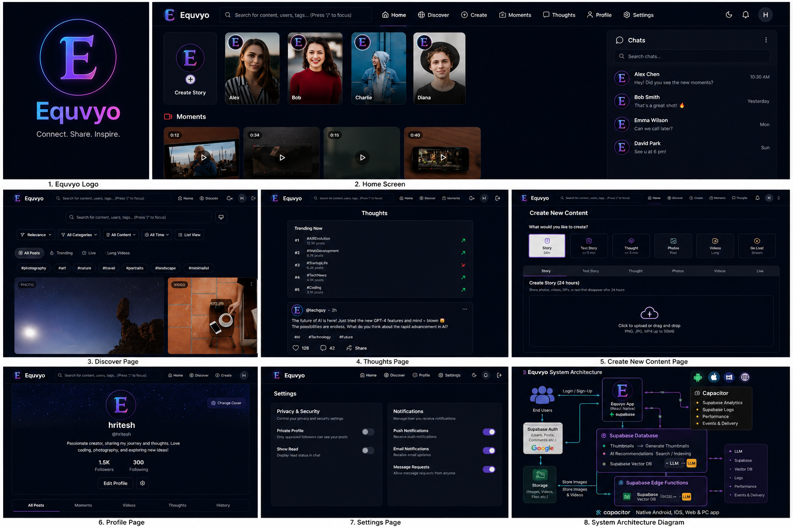
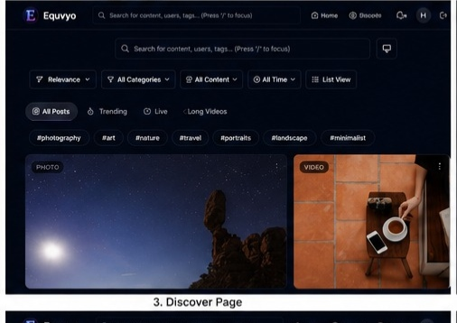
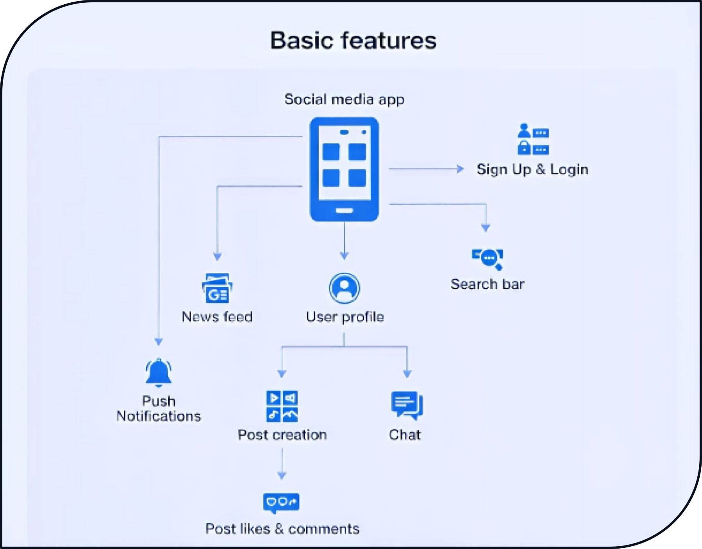

<!-- ========================================================= -->

<!--                    EQUYVO README - PART 1                 -->

<!-- ========================================================= -->

<div align="center">


# 🌍 Equyvo

### Modern Cross-Platform Social Media Platform

<p>

A next-generation social media platform built using **React**, **TypeScript**, **Vite**, **Supabase**, and **Capacitor**.

Designed to deliver a fast, secure and immersive experience across **Android**, **iOS**, **Web**, and **Desktop**.

</p>

<br>


<br>

⭐ If you like this project, consider giving it a **Star**.

</div>

---

# 📑 Table of Contents

* Overview
* Why Equyvo?
* Features
* Application Preview
* Screenshots
* Technology Stack
* Architecture
* Installation
* Project Report
* Future Roadmap
* Author

---

# 🚀 Overview

Equyvo is a modern cross-platform social networking application that combines the most engaging features from today's leading social platforms into one seamless experience.

The application focuses on speed, accessibility, security and scalability while delivering a beautiful user experience across multiple devices.

It is optimized for:

* 🌐 Web
* 🤖 Android
* 🍎 iOS
* 💻 Desktop

Built with modern technologies including React, TypeScript, Vite, Supabase and Capacitor.

---

# 💡 Why Equyvo?

Most social media platforms focus on a single type of interaction.

Equyvo brings multiple experiences together into one unified platform.

Users can:

* 📷 Share Stories
* 🎥 Watch Moments
* 💬 Post Thoughts
* 📸 Upload Images
* 🎞 Share Videos
* 💬 Chat in Real Time
* 👤 Manage Profiles
* 🔍 Discover People
* 🤖 Search using AI-powered features

All inside one modern application.

---

# ✨ Key Features

### 👤 User Authentication

* Secure Login
* Secure Registration
* Session Management

---

### 📱 Social Features

* Stories
* Moments
* Posts
* Thoughts
* Likes
* Comments
* Sharing
* Follow System

---

### 💬 Communication

* Real-time Chat
* Online Status
* Media Sharing
* Notifications

---

### 🤖 Smart Features

* AI Powered Search
* Smart Recommendations
* Discover Page

---

### ⚡ Performance

* Offline Support
* Fast Loading
* Error Recovery
* Network Monitoring

---

### 🌍 Cross Platform

Supports

* Android
* iOS
* Web
* Desktop

---

# 🖼 Project Overview

<p align="center">



</p>

---

# 📱 Application Screens

## 🏠 Home


---

## 🔍 Discover



---

## ➕ Create


---

## 💭 Thoughts


---

## 👤 Profile


---

## ⚙️ Settings


---

> ✅ **End of Part 1**

The next part will include:

* 🛠 Technology Stack
* 📂 Folder Structure
* 🏗 Architecture
* 📦 Installation
* 🚀 Deployment
* 📄 Project Report

<!-- ========================================================= -->

<!--                    EQUYVO README - PART 2                 -->

<!-- ========================================================= -->

# 🛠 Technology Stack

## 🎨 Frontend

| Technology   | Purpose               |
| ------------ | --------------------- |
| React 18     | User Interface        |
| TypeScript   | Type Safety           |
| Vite         | Fast Build Tool       |
| Tailwind CSS | Styling               |
| Radix UI     | Accessible Components |
| Lucide React | Icons                 |

---

## ⚙ Backend & Services

| Technology       | Purpose                  |
| ---------------- | ------------------------ |
| Supabase         | Authentication           |
| PostgreSQL       | Database                 |
| Supabase Storage | Media Storage            |
| Capacitor        | Android & iOS Deployment |

---

## 🌍 Platform Support

| Platform   | Supported |
| ---------- | --------- |
| 🌐 Web     | ✅         |
| 🤖 Android | ✅         |
| 🍎 iOS     | ✅         |
| 💻 Desktop | ✅         |

---

# 📋 Basic Features

<p align="center">



</p>

---

# 🏗 System Architecture

<p align="center">


</p>

---

# 📁 Project Structure

```text
Equyvo
│
├── android/
├── ios/
├── public/
├── src/
├── assets/
│   ├── logo.png
│   ├── overview.png
│   ├── home.png
│   ├── discover.png
│   ├── create.png
│   ├── thoughts.png
│   ├── profile.png
│   ├── settings.png
│   ├── basic-features.png
│   ├── architecture.png
│   └── Equyvo_Project_Report.pdf
│
├── package.json
├── vite.config.ts
└── README.md
```

---

# 📦 Installation

## Clone Repository

```bash
git clone https://github.com/ashirbad003/Equyvo-social-media-platform.git
```

---

## Open Project

```bash
cd Equyvo-social-media-platform
```

---

## Install Dependencies

Using npm

```bash
npm install
```

Using pnpm

```bash
pnpm install
```

---

## Run Development Server

```bash
npm run dev
```

---

## Production Build

```bash
npm run build
```

---

## Preview Production Build

```bash
npm run preview
```

---

# 📄 Environment Variables

Create a `.env` file in the project root.

```env
VITE_SUPABASE_URL=YOUR_SUPABASE_URL
VITE_SUPABASE_ANON_KEY=YOUR_SUPABASE_ANON_KEY
```

---

# 🚀 Deployment

### Web

* Vercel
* Netlify
* GitHub Pages (after configuration)

### Android

```bash
npx cap sync android
npx cap open android
```

### iOS

```bash
npx cap sync ios
npx cap open ios
```

---

# 📄 Project Report

The complete documentation is available inside this repository.

📘 **Project Report**

```text
assets/Equyvo_Project_Report.pdf
```

---

# 📊 Performance Highlights

* ⚡ Optimized Bundle Splitting
* ⚡ Lazy Loaded Components
* ⚡ Responsive UI
* ⚡ Smooth Animations
* ⚡ Error Recovery
* ⚡ Offline Support
* ⚡ Secure Authentication
* ⚡ Network Detection
* ⚡ Cross Platform Performance

---

> ✅ **End of Part 2**

Next part includes:

* 🌟 Roadmap
* 🤝 Contributing
* 👨‍💻 About the Developer
* 📜 License
* ⭐ Support
* ❤️ Footer

<!-- ========================================================= -->

<!--                    EQUYVO README - PART 3                 -->

<!-- ========================================================= -->

# 🗺️ Roadmap

## 🚀 Upcoming Features

* 🤖 AI Recommendation Engine
* 🎥 Video Calling
* 🎙️ Voice Rooms
* 📡 Live Streaming
* 💸 Creator Monetization
* 🛍️ Marketplace
* 👥 Communities & Groups
* 🌍 Multi-language Support
* 📊 Creator Analytics Dashboard
* 🔔 Smart Push Notifications

---

# 🔐 Security

Equyvo follows modern security practices.

* Secure Authentication
* JWT Session Management
* Environment Variable Protection
* Input Validation
* Protected Routes
* XSS Protection
* CSRF Protection
* Secure Database Access

---

# ⚡ Performance

Optimized for a smooth user experience.

* Lazy Loading
* Code Splitting
* Optimized Images
* Responsive Layout
* Fast Navigation
* Offline Support
* Network Detection
* Error Recovery
* Efficient Rendering

---

# 🤝 Contributing

Contributions are welcome!

1. Fork this repository.
2. Create a new feature branch.
3. Commit your changes.
4. Push your branch.
5. Open a Pull Request.

---

# 📝 License

This project is licensed under the **MIT License**.

Feel free to use, modify and improve this project while respecting the license terms.

---

# 👨‍💻 Developer

<div align="center">

## Ashirbad Pattnaik

**B.Tech – Computer Science & Technology**

National Institute of Science and Technology

</div>

### 🌐 Portfolio

```text
https://ash-tech.lovable.app/
```

### 💻 GitHub

```text
https://github.com/ashirbad003
```

### 📂 Repository

```text
https://github.com/ashirbad003/Equyvo-social-media-platform
```

---

# 💖 Acknowledgements

Special thanks to the open-source community and the developers behind:

* React
* TypeScript
* Vite
* Supabase
* Capacitor
* Tailwind CSS
* Radix UI
* Lucide React

Their amazing tools made this project possible.

---

# 🌟 Support

If you found this project useful,

⭐ **Star the repository**

🍴 **Fork the repository**

💬 **Share your feedback**

Every contribution and suggestion helps improve Equyvo.

---

# 📬 Contact

If you'd like to collaborate, discuss ideas, or provide feedback, feel free to reach out through GitHub or my portfolio.

---

<div align="center">

## 🚀 Built with ❤️ by Ashirbad Pattnaik

### ⭐ If you like Equyvo, don't forget to Star this repository!


**Modern • Scalable • Cross-Platform • Built for Everyone**

</div>
